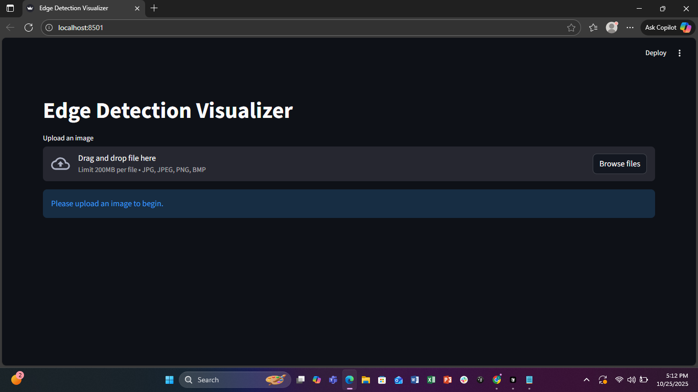
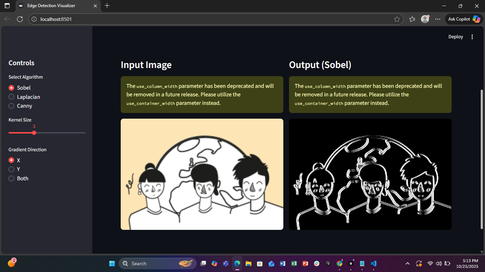
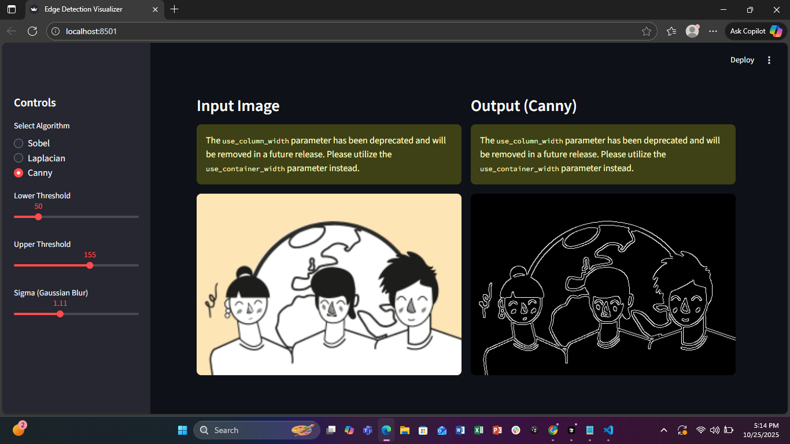
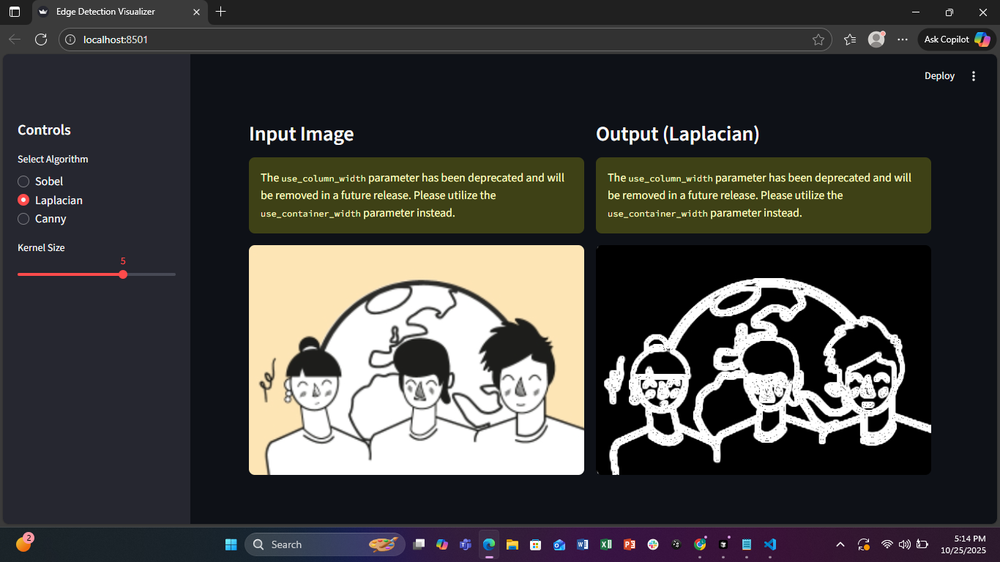

# Edge Detection Visualizer

An interactive web application for visualizing different edge detection algorithms on images. This Streamlit-based tool allows users to upload images and apply various edge detection algorithms with customizable parameters.

## Project Description

The Edge Detection Visualizer is a user-friendly application that implements three classic edge detection algorithms:
- **Sobel Operator**: Detects edges using gradient approximations in X, Y, or both directions
- **Laplacian Operator**: Detects edges using the second derivative
- **Canny Edge Detector**: Advanced multi-stage algorithm for optimal edge detection

The application provides real-time visualization with adjustable parameters, making it perfect for learning about edge detection algorithms or testing different configurations on your images.

## Features

- **Interactive UI**: Streamlit-based web interface with sidebar controls
- **Multiple Algorithms**: Support for Sobel, Laplacian, and Canny edge detection
- **Adjustable Parameters**:
  - Sobel: Kernel size and gradient direction (X, Y, or Both)
  - Laplacian: Kernel size
  - Canny: Lower/upper thresholds and Gaussian blur sigma
- **Side-by-side Comparison**: View original and processed images simultaneously
- **Upload Support**: Supports JPG, JPEG, PNG, and BMP image formats

## Setup and Installation

### Prerequisites

- Python 3.7 or higher
- pip (Python package manager)

### Installation Steps

1. **Clone the repository** (or download the project files):
   ```bash
   git clone <your-repository-url>
   cd cv
   ```

2. **Create a virtual environment** (recommended):
   ```bash
   python -m venv .venv
   ```

3. **Activate the virtual environment**:
   - On Windows:
     ```bash
     .venv\Scripts\activate
     ```
   - On macOS/Linux:
     ```bash
     source .venv/bin/activate
     ```

4. **Install required dependencies**:
   ```bash
   pip install -r requirements.txt
   ```

## How to Run the Application

1. **Ensure the virtual environment is activated** (if you created one)

2. **Run the Streamlit application**:
   ```bash
   streamlit run app.py
   ```

3. **Open your browser** to the URL shown in the terminal (usually `http://localhost:8501`)

4. **Upload an image** using the file uploader

5. **Select an algorithm** and adjust parameters in the sidebar

6. **View the results** in the side-by-side comparison view

## Project Structure

```
cv/
├── app.py                 # Main application entry point
├── ui.py                  # User interface rendering
├── image_utils.py         # Image loading and conversion utilities
├── algorithms/            # Edge detection algorithm implementations
│   ├── __init__.py
│   ├── sobel.py          # Sobel edge detection
│   ├── laplacian.py      # Laplacian edge detection
│   └── canny.py          # Canny edge detection
├── requirements.txt       # Python dependencies
├── README.md             # Project documentation
└── .venv/                # Virtual environment (not committed)
```

## Technologies Used

- **Streamlit**: Web framework for building the interactive UI
- **OpenCV (cv2)**: Computer vision library for edge detection algorithms
- **NumPy**: Numerical computing for image processing
- **Pillow (PIL)**: Image handling and format conversion

## Additional Features

- **Grayscale Conversion**: Automatic conversion of RGB images to grayscale for edge detection
- **Real-time Processing**: Instant updates when parameters change
- **Responsive Layout**: Wide layout optimized for side-by-side image comparison
- **Error Handling**: User-friendly warnings and information messages

### Original vs Edge Detected



### Sobel



### Canny



### Laplacian



## Author

Created as part of a Computer Vision course project demonstrating edge detection algorithms.

